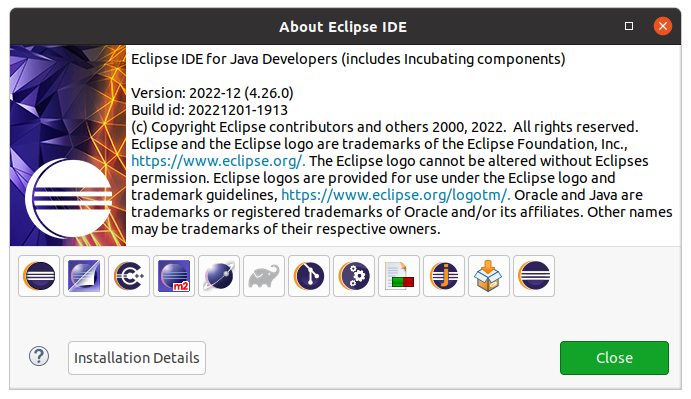
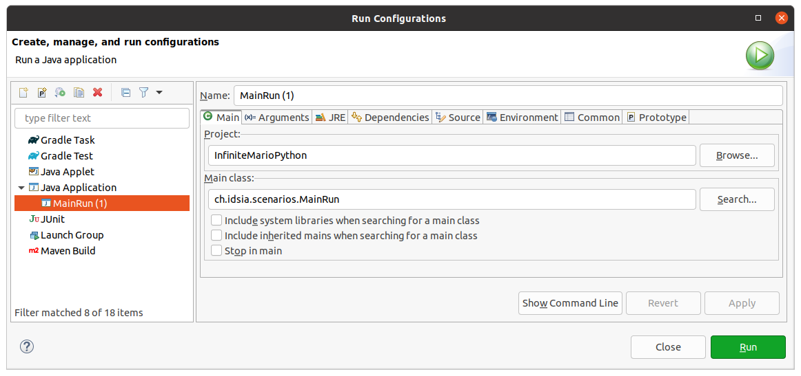
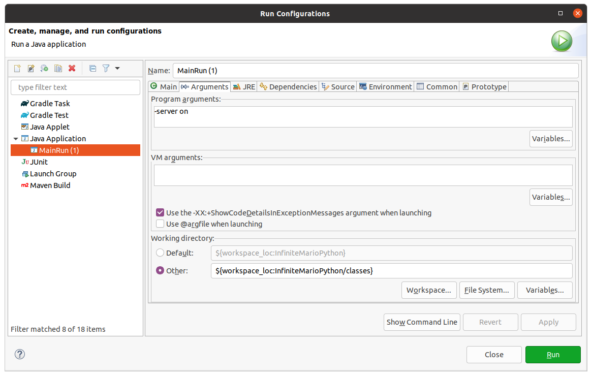

# Python Agent for Infinite Mario

Press 'v' in the Mario window that appears to toggle visualisation. (See src/ch/idsia/ai/agents/human/CheaterKeyboardAgent.java) for a list of all the keyboard instructions.

Steps to get running:
* Download this repo.
* Install Eclipse. I've tested the instructions with this version:


* Open the project in Eclipse via File -> Open Projects from File System... Just select the main folder (InfiniteMarioPython), not the 'src' subdirectory or anything else.
* Run the server from Eclipse by specifying '-server on' in the program arguments. One issue I had is that the default working directory (in the second screenshot below) was somehow set incorrectly. Overriding it by clicking *Other* and specifying the "classes" subdirectory solved the problem.




* Open a terminal in the 'src' directory.
* Activate a Python 2 conda environment if necessary.
* ```python python/competition/ipymario.py ```
* This should launch the custom 'MichaelAgent' I've created that randomly runs left and right.
